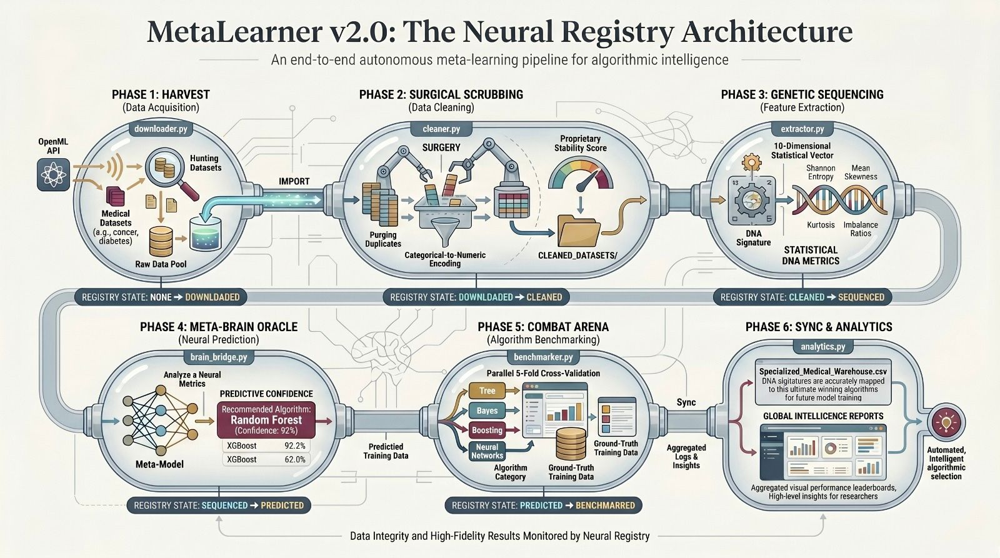

# 🧬 MetaLearner: Neural Ranking Engine for Medical Informatics

[](https://www.python.org/)
[](https://xgboost.readthedocs.io/)
[](https://fastapi.tiangolo.com/)
[](https://en.wikipedia.org/wiki/Automated_machine_learning)
[](https://en.wikipedia.org/wiki/Meta_learning_(computer_science))


**MetaLearner** is a modular Automated Machine Learning (AutoML) framework designed to solve the "Algorithm Selection Problem" in medical informatics. Instead of traditional trial-and-error training, MetaLearner sequences the statistical **DNA** of a dataset to predict the optimal machine learning architecture before training begins.



---

## 🚀 Key Innovation: Dataset DNA
MetaLearner operates on the principle of **Genetic Sequencing for Data**. It extracts a high-fidelity 10-dimensional vector—the Dataset DNA—representing the geometric and statistical properties of medical data:

* **Information Entropy:** Measuring target complexity and class density.
* **Imbalance Profiling:** Specialized handling for rare medical markers.
* **Geometric Skew & Kurtosis:** Identifying outlier distributions and data shapes.
* **Correlation Stability:** Detecting feature redundancy and internal noise.

## 🧠 Neural Ranker Architecture
Unlike standard classifiers that simply "guess" a winner, MetaLearner utilizes a **Neural Ranker (XGBoost Regressor)**. It studies the comparative performance of all available solutions to predict the expected **F1-Score** across 10 distinct algorithm categories.

---

## 🛠️ System Architecture

The framework is decentralized into specialized modules for maximum pipeline stability:

| Module | Purpose |
| :--- | :--- |
| **`core/downloader.py`** | Automated harvester for curated OpenML medical datasets. |
| **`core/cleaner.py`** | Intelligent data surgery and feature stabilization. |
| **`core/extractor.py`** | Genetic sequencer for 10-D statistical DNA extraction. |
| **`archive/train.py`** | Neural Ranker training using **Hold-out Validation** and **Jitter Augmentation**. |
| **`core/brain_bridge.py`** | **The Oracle**: Simulates and ranks all 10 algorithms for new data. |
| **`app.py`** | **FastAPI Dashboard**: Real-time web interface for algorithm prediction. |
| **`main.py`** | Centralized Command Center and Neural Pipeline control. |

---

## 📦 Installation

1.  **Clone the Repository:**
    ```bash
    git clone https://github.com/AhmedTEldeeb44/metalearner.git
    cd metalearner
    ```

2.  **Initialize Virtual Environment:**
    ```bash
    python -m venv .venv
    # Windows:
    .venv\Scripts\activate
    # Linux/Mac:
    source .venv/bin/activate
    ```

3.  **Install Dependencies:**
    ```bash
    pip install -r requirements.txt
    ```

---

## 🎮 Usage

The system is managed via a centralized Command Center. To start the neural pipeline, run:

```bash
python main.py
```

For the web-based Neural Oracle dashboard:
```bash
python app.py
```

## 🛰️ Core Pipeline Commands

The system is managed via a centralized Command Center. To orchestrate the neural pipeline, the following modules are utilized:

* **`[1] Harvest Data`**: Pull new medical datasets into the warehouse.
* **`[4] Multi-Threaded Combat`**: Benchmark algorithms to generate ground-truth training data.
* **`[5] Consult the Meta-Brain`**: Run a neural simulation on any CSV to generate an algorithm leaderboard.
* **`[B] Bronze Browser`**: Test the Oracle against raw, uncleaned "Bronze" datasets.

---

## 🔬 Research & Academic Context

This project serves as the foundational framework for the ongoing research paper:

> **"MetaLearner: A DNA-Based Neural Ranking Engine for Automated Machine Learning Selection in Medical Informatics."**

The methodology focuses on extracting high-fidelity statistical markers—Dataset DNA—to map the geometric properties of medical data directly to algorithmic performance profiles.

---

## 📊 Current Neural Benchmarks (XGBoost Regressor)

The **MetaLearner** engine is currently calibrated using an XGBoost-based Neural Ranker, achieving high-fidelity predictive stability:

* **Neural Stability**: `88.78% R² Score` on blind test trials.
* **Mean Absolute Error**: `0.0341 F1-Points`.
* **Inference Speed**: `< 0.5s` for total algorithm ranking on 10,000+ row datasets.

---

## 👨‍💻 Developed By

**Ahmed T. El-Deeb**
*AI Engineer*